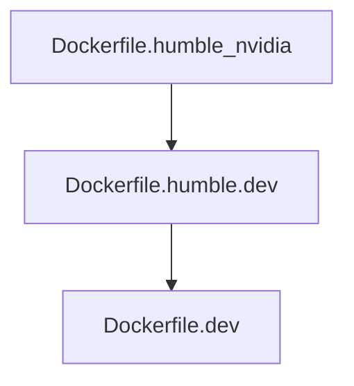

## Docker

- [dev docker base on ubuntu Dockerfile.humble_nvidia (pov:humble)](Dockerfile.humble.dev)


```
docker build -t pov:humble -f Dockerfile.humble_nvidia
```

### stage 1
ubuntu 22.04 with cuda runtime 11.8
ros2 humble
gazebo harmonic
gazebo harmonic ros bridge

### stage 2
- ros package common for many projects
    - mavros
    - cyclone dds
    - cv bridge
    - web bridge
    - ros utils
        - rqt
        - tf
- gstreamer and gst  python bindings
- common python packages
    - opencv and opencv contrib (4.5.4.60)
    - matplotlib


### stage 3 (project specifics)




---

## ubuntu 24.04
For now only the humble version are support
the jazzy file for future time
- using ros jazzy